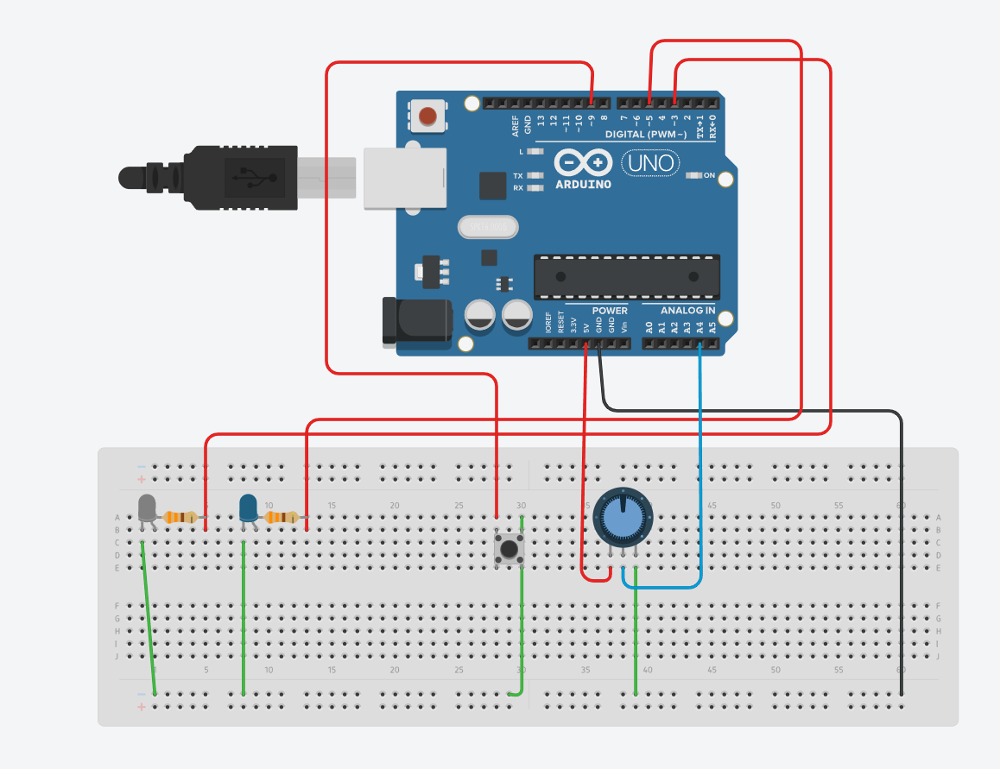

# Dimmable LED Controller

## Table of Contents

- [Description](#description)
- [Components](#components)
- [Features](#features)
- [How to use](#how-to-use)
- [What I learned](#what-i-learned)
- [Circuit Diagram](#circuit-diagram)
- [Project structure](#project-structure)
- [Code](#code)

## Description
This project allows you to control the brightness of two LEDs using a potentiometer. A button is used to turn the LEDs on and off. The current brightness level is displayed in the Serial Monitor.

This project demonstrates basic usage of digital and analog inputs/outputs in Arduino, including PWM and button edge detection.

## Components
- Arduino (e.g., Uno)
- 2 LEDs
- Resistors (e.g., 220Ω or 330Ω)
- Potentiometer
- Push button
- Jumper wires
- Breadboard (optional)

## Features
- Brightness control using potentiometer (PWM)
- Button toggles LEDs ON/OFF
- Serial Monitor displays current brightness
- Optimized Serial output (prints only when value changes)

## How to use
1. Connect the circuit according to the pin configuration in the code.
2. Upload the code to Arduino.
3. Open Serial Monitor at 9600 baud.
4. Use the potentiometer to adjust brightness.
5. Use the button to toggle LEDs.

## What I learned
- PWM control in Arduino
- Working with analog inputs
- Button edge detection
- Optimizing Serial communication

## Circuit Diagram



**Description:**
- Two LEDs connected to PWM pins with 330Ω resistors.
- Potentiometer connected to an analog input.
- Push button connected to a digital pin with pull-down/up resistors.
- GND and 5V connections as needed.

## Project structure

- `code.ino` - Main Arduino code.
- `README.md` - This documentation.
- `arduino_led_circuit.png` - Circuit diagram image.

## Code

```cpp
// Pin configuration
int whiteLedPin = 3;
int blueLedPin = 5;
int potentiometerPin = A4;
int buttonPin = 9;

// Variables for potentiometer and brightness
int potValue;       // Raw value from potentiometer (0-1023)
int brightness;     // Mapped brightness value (0-255)

// Button handling (edge detection)
bool buttonState;                       // Current state of the button
bool ledEnabled = false;                // Whether LEDs are ON or OFF
bool previousButtonState = HIGH;        // Previous button state (for the edge detection)

// Store last printed brightness to avoid spamming Serial Monitor
int previousBrightness = -1;

void setup() {
  Serial.begin(9600);

  // Set up pin modes
  pinMode(whiteLedPin, OUTPUT);
  pinMode(blueLedPin, OUTPUT);
  pinMode(potentiometerPin, INPUT);
  pinMode(buttonPin, INPUT_PULLUP);   // Internal pull-up resistor
}

void loop() {
  // Read potentiometer and map to brightness (0-255)
  potValue = analogRead(potentiometerPin);
  brightness = map(potValue, 0, 1023, 0, 255);

  // Detect button press (transition from HIGH to LOW)
  buttonState = digitalRead(buttonPin);
  if (previousButtonState == HIGH && buttonState == LOW) {
  ledEnabled = !ledEnabled;       // Toggle LED state
  }

  // Update previous button state
  previousButtonState = buttonState;

  // If LEDs are enabled
  if (ledEnabled) {

    // Set LED brightness using PWM
    analogWrite(whiteLedPin, brightness);
    analogWrite(blueLedPin, brightness);

    // Print brightness only if it changed
    if (previousBrightness != brightness) {

      Serial.print("Brightness: ");
      Serial.println(brightness);
      previousBrightness = brightness;
    }
  } else {

    // Turn off LEDs
    analogWrite(whiteLedPin, 0);
    analogWrite(blueLedPin, 0);

    // Print 0 only once when LEDs turn off
    if(previousBrightness != 0) {
      Serial.println("Brightness: 0");
      previousBrightness = 0;
    }
  }
}
```
